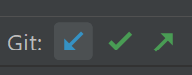
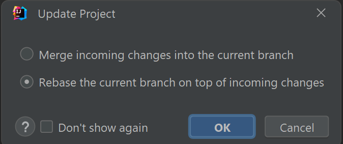
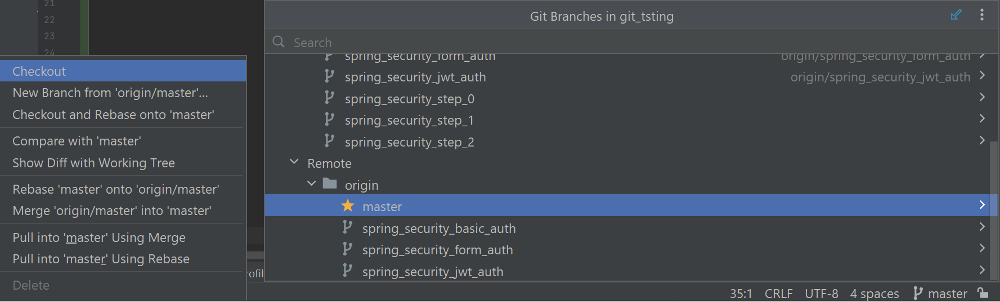

# git stuff in idea

# 1. to update:

\

# 2. to change branch:

* we `checkout` to remote branch `master`
* git automatically creates local branch `master` connected to remote branch `master` (if there are no local branches with name `master`)

